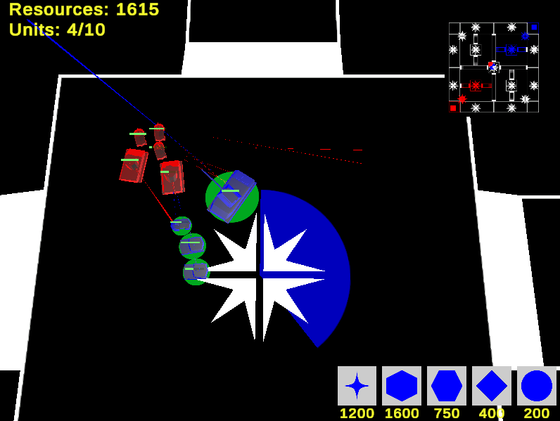
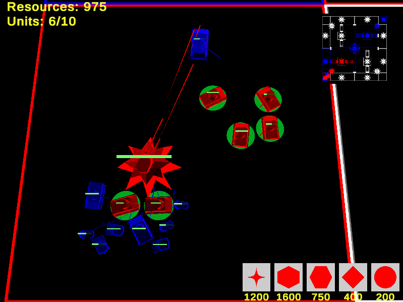

  

# What is this?

This one is a real time strategy with tanks which you can play with your four friends on LAN. Manage various tanks, capture control points and destroy your enemies' bases. Pretty simple and fun, isn't it?

## Features

- Five various units with own characteristics

> Buy units using buttons at the down right of the screen. Cheap units are fast and light, expensive ones are slow and powerful.

- Capture control points

- Play on LAN with up to four players

## How to play?

On my [google disk](https://drive.google.com/drive/folders/1z0nGu2WdlKUQMODIbncrFWw3gqiZ5uPf) you can find downloadable archive. You should LAN connection or its imitation (Radmin, Hamachi) to play the game.

# Что это такое?

Это стратегия в реальном времени с танчиками, в которую можно поиграть вчетвером по локальной сети. Управляйте разными танчиками, захватывайте контрольные точки, уничтожайте базы ваших противников. Веселая и очень простая штука.

## Особенности игры

- Пять разных юнитов со своими характеристиками

> Покупайте юнитов кнопками в правом нижнем углу экрана. Дешевые юниты быстрые и легкие, а дорогие медлительные и сильные.

- Захват контрольных точек

> Каждая захваченная контрольная точка приносит ресурсы

- Игра по локальной сети, поддерживающая до четырех игроков

## Как поиграть?

На моем [гугл диске](https://drive.google.com/drive/folders/1z0nGu2WdlKUQMODIbncrFWw3gqiZ5uPf) лежит архив, который можно скачать. Для игры нужно подключение по локальной сети или его имитация (Radmin, Hamachi)